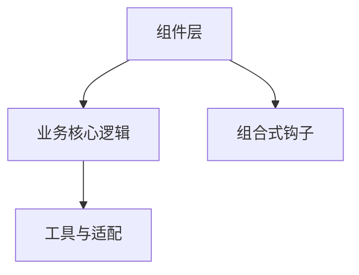
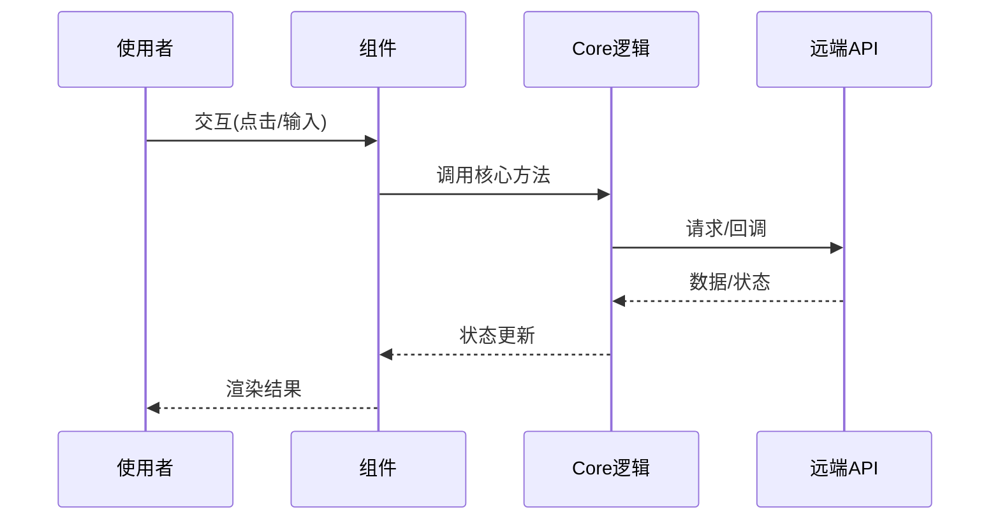

# 架构设计

## 总体架构

## 技术栈
- **前端:** Vue 3 + Element Plus + Vite
- **测试:** Vitest + happy-dom
- **构建:** pnpm / vite build

## 核心流程

## 重大架构决策
完整的 ADR 存储在各变更的 how.md 中，本章节提供索引。

| adr_id | title | date | status | affected_modules | details |
|--------|-------|------|--------|------------------|---------|
| ADR-0001 | 初始化知识库骨架 | 2025-12-11 | ✅已采纳 | all | history/2025-12/202512111646_coverage/why.md |
